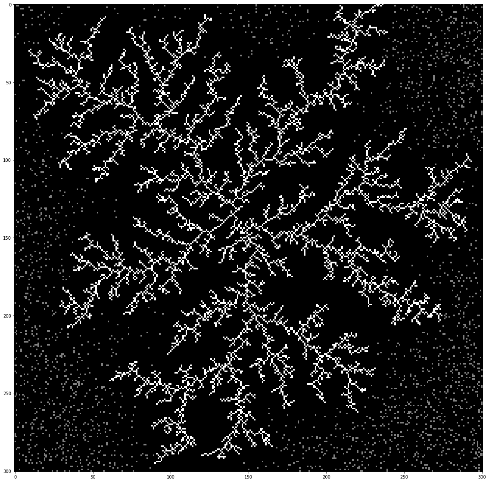
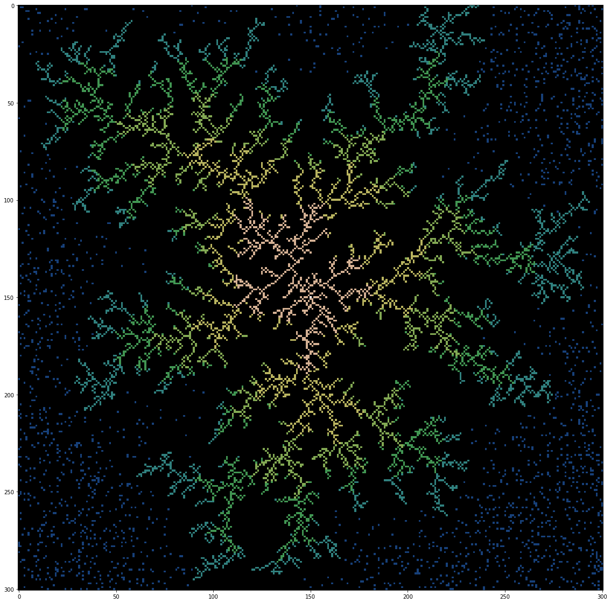

# Brownian tree pytorch
Brownian tree is a simulation of diffusion-limited aggregation process. It also can be refered as Lichtenberg figure and it's perfect example of stochastic fractal.

## Screenshots


Grey - moving particles  
White - frozen particles


Blue - moving particles  
Other - different time slices of frozen particles


## Animated experiments:  
### [Imgur](https://imgur.com/a/WBqmHz7)

## Instalation
```
$ pip install torch==1.5.0+cu101 torchvision==0.6.0+cu101 -f https://download.pytorch.org/whl/torch_stable.html
$ pip install -r requirements.txt
$ sudo apt install ffmpeg -y
```
## Benchmarking
|Configuration|Grid size|Particles percent|Iterations|Time (sec)|
|---|---|---|---|---|
**cpu+numpy**|**301**|**10**|**1500**|**535**
cpu+pytorch+oldMoveFunc|301|10|1500|2544
gpu+pytorch+oldMoveFunc|301|10|1500|7627
cpu+pytorch|301|10|1500|37
**gpu+pytorch**|**301**|**10**|**1500**|**12**
gpu+pytorch|501|10|1500|30
gpu+pytorch|1001|10|1500|128
gpu+pytorch|301|20|1500|19
gpu+pytorch|301|30|1500|19
gpu+pytorch|301|10|5000|36
gpu+pytorch|301|10|10000|47

## Tested on
* CPU: Intel(R) Core(TM) i5-6600K CPU @ 3.50GHz
* GPU: GeForce GTX 1070